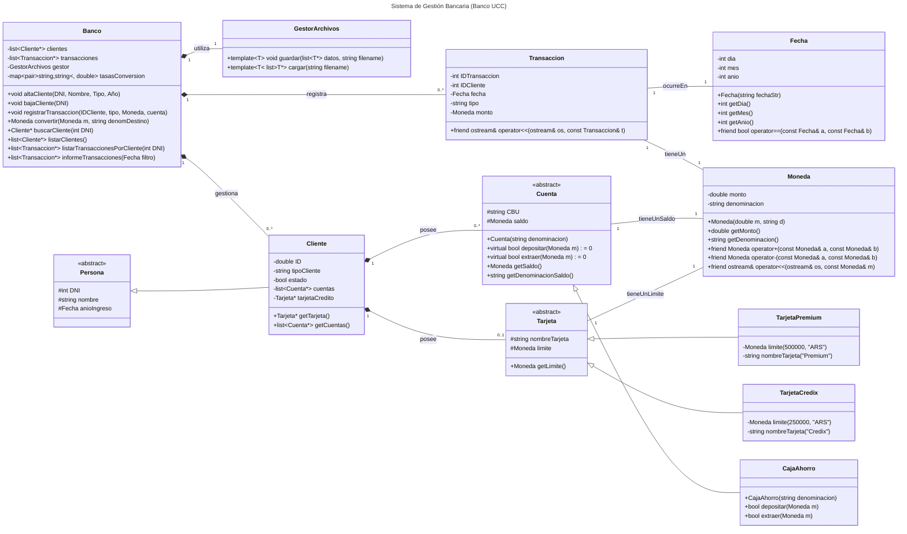

# Sistema de Gestión Bancaria UCC

Este diagrama de clases UML modela el tema 2 del proyecto final de Programación Orientada a Objetos. Consiste en un sistema de gestión que permite realizar el registro y control de actividades que se llevan a cabo en la UCC.

## Descripción del diagrama
La clase central del sistema es **Banco**, que actúa como el facade o **gestor principal**, administrando las **colecciones de Cliente y Transaccion**. Utiliza un **GestorArchivos** para la persistencia de datos y mantiene un registro de tasas de conversión para operaciones con divisas. Realiza las siguientes funciones:
- Alta/Baja de clientes, 
- registro de transacciones,
- búsqueda, 
- listado,
- informes (incluyendo conversión interna de Moneda)

El **GestorArchivos** implementa la lógica de persistencia de datos al guardar y cargar colecciones de objetos (template T) de forma segura, validando el tipo de dato en el tiempo de ejecución y evitando que el proceso principal se congele.

El sistema distingue entre la información básica de una persona y el rol de cliente bancario.
- Persona (<<abstract>>): clase base que define los atributos de identificación comunes: DNI, nombre y el anioIngreso (utilizando la clase Fecha).
- Cliente: hereda de Persona y añade atributos específicos del cliente (ID, tipoCliente, estado). Un cliente posee múltiples **Cuenta**s y puede poseer una única Tarjeta.

Además, se define una jerarquía para los productos financieros, basada en clases abstractas.
- ***Cuentas***
→ **Cuenta (<<abstract>>):** clase base para todos los tipos de cuentas. Define el CBU y el saldo (de tipo Moneda). Establece la interfaz para las operaciones básicas con métodos virtuales puros: depositar() y extraer().
	→ **CajaAhorro:** implementación concreta de Cuenta, proporcionando la lógica específica para las operaciones de depósito y extracción.

- ***Tarjetas***
→ **Tarjeta (<<abstract>>):** clase base que establece la interfaz para las tarjetas, definiendo un nombreTarjeta y un limite (de tipo Moneda).
	→ **TarjetaCredix y TarjetaPremium:** implementaciones concretas de Tarjeta, que se diferencian principalmente por su limite de crédito predefinido (e.g., $250.000 y $500.000 ARS, respectivamente).

Finalmente, se usan clases adicionales para el formato de los datos como Moneda, Fecha y Transacción
- **Moneda:** encapsula un monto (double) junto a su denominacion (string). Sobrecarga los operadores de suma (+) y resta (-) para facilitar operaciones monetarias y permite su output a streams (ostream).
- **Fecha:** almacena día, mes y año. Permite la construcción a partir de un string y sobrecarga el operador de igualdad (==) para comparaciones.
- **Transaccion:** registra las operaciones realizadas. Contiene IDTransaccion, IDCliente, tipo (e.g., "depósito", "extracción"), la fecha y el monto (de tipo Moneda).