# Sistema de Gestión Bancaria UCC

Este diagrama de clases UML modela el tema 2 del proyecto final de Programación Orientada a Objetos. Consiste en un sistema de gestión que permite realizar el registro y control de actividades que se llevan a cabo en la UCC.

```mermaid
---
title: Sistema de Gestión Bancaria (Banco UCC)
---
classDiagram
    direction LR

    %% --- Clases Principales ---
    
    class Banco {
        -vector~Cliente*~ clientes
        -vector~Transaccion*~ transacciones
        -GestorArchivos gestor
        +map~pair~string, string~, double~ tasasConversion
        +Banco()
        +~Banco()
        +bool altaCliente(Cliente* cliente)
        +bool bajaCliente(double id)
        +void buscarCliente(double id)
        +void listadoClientes()
        +void informeTransacciones()
        +void informeTransacciones(double id)
        +void informeTransacciones(Fecha desde, Fecha hasta)
        +double convertirMoneda(double monto, string desde, string hacia)
        +void registrarTransaccion(Transaccion* trans)
        +CajaAhorro* buscarCuentaPorCBU(string cbu)
        +Cliente* buscarClientePorCBU(string cbu)
        +bool realizarDeposito(string cbu, double monto, string denominacion, double idClienteOperador)
        +bool realizarExtraccion(string cbu, double monto, string denominacion, double idClienteOperador)
        +Cliente* buscarClientePorID(double id)
        +bool crearCuentaParaCliente(double idCliente, string denominacion)
        +bool eliminarCuentaDeCliente(double idCliente, string cbu)
        +void guardarTarjetas()
    }

    class GestorArchivos {
        +template~T~ void cargar(vector~T*~& datos, const string& NombreArchivo)
        +template~T~ void guardar(const vector~T*~& datos, const string& NombreArchivo)
        +void guardarTarjetas(const vector~Cliente*~& clientes, const string& NombreArchivo)
        +void guardarCuentas(const vector~Cliente*~& clientes, const string& NombreArchivo)
    }

    %% --- Entidades (Persona y Cliente) ---

    class Persona {
        #string DNI
        #string nombre
        #Fecha ingreso
        +Persona(string dni, string Nombre)
        +string getDNI()
        +string getNombre()
        +Fecha getAnioIngreso()
        +virtual ~Persona() = default
    }

    class Cliente {
        -double ID
        -string tipoCliente
        -bool estado
        -vector~CajaAhorro*~ cuentas
        -Tarjeta* tarjeta
        -void generarID()
        +Cliente(string dni, string Nombre, string Tipo)
        +double getID()
        +string getTipoCliente()
        +bool getEstado()
        +vector~CajaAhorro*~ getCuentas()
        +Tarjeta* getTarjeta()
        +void setEstado(bool estado)
        +void setTipoCliente(string tipo)
        +void agregarCuenta(CajaAhorro* cuenta)
        +void eliminarCuenta(string cbu)
        +void setTarjeta(Tarjeta* t)
    }

    %% --- Productos Bancarios (Cuenta y Tarjeta) ---

    class CajaAhorro {
        -string CBU
        -Moneda saldo
        -void generarCBU()
        +CajaAhorro(string denominacion)
        +bool depositar(Moneda monto)
        +bool extraer(Moneda monto)
        +Moneda getSaldo()
        +string getCBU()
    }

    class Tarjeta {
        #Moneda saldo
        #string nombreTarjeta
        #Moneda limite
        +Tarjeta(string nombre, Moneda lim)
        +Moneda getLimite()
        +string getNombreTarjeta()
    }

    %% --- Clases de Datos y Utilidad ---

    class Transaccion {
        -int IDTransaccion
        -int IDCliente
        -string CBU
        -Fecha fecha
        -Moneda monto
        -void generarIDTransaccion()
        +Transaccion(string cbu, Moneda m, int idCliente)
        +int getIDTransaccion()
        +int getIDCliente()
        +string getCBU()
        +Fecha getFecha()
        +Moneda getMonto()
    }

    class Fecha {
        -int dia
        -int mes
        -int anio
        +Fecha()
        +Fecha(int dia, int mes, int anio)
        +Fecha(string fechaStr)
        +int getDia()
        +int getMes()
        +int getAnio()
        +void setDia(int d)
        +void setMes(int m)
        +void setAnio(int a)
        +friend ostream& operator<<(ostream& os, const Fecha& f)
        +friend bool operator==(const Fecha& f1, const Fecha& f2)
    }

    class Moneda {
        -double monto
        -string denominacion
        +Moneda()
        +Moneda(double m, string d)
        +Moneda(string d)
        +double getMonto()
        +string getDenominacion()
        +friend Moneda operator+(const Moneda& m1, const Moneda& m2)
        +friend Moneda operator-(const Moneda& m1, const Moneda& m2)
        +friend ostream& operator<<(ostream& os, const Moneda& m)
        +friend bool operator>(const Moneda& m1, const Moneda& m2)
        +friend bool operator<(const Moneda& m1, const Moneda& m2)
    }

    %% --- Relaciones ---

    Banco "1" *-- "1" GestorArchivos : utiliza
    Banco "1" *-- "0..*" Cliente : gestiona
    Banco "1" *-- "0..*" Transaccion : registra

    Persona <|-- Cliente

    Cliente "1" *-- "0..*" CajaAhorro : posee
    Cliente "1" *-- "0..1" Tarjeta : posee

    Transaccion "1" -- "1" Fecha : ocurreEn
    Transaccion "1" -- "1" Moneda : tieneUn
    CajaAhorro "1" -- "1" Moneda : tieneUnSaldo
    Tarjeta "1" -- "1" Moneda : tieneUnLimite
```

## Descripción del diagrama

La clase central del sistema es **Banco**, que actúa como el facade o **gestor principal**, administrando las colecciones de **Cliente** y **Transaccion** (almacenadas como `vector` de punteros). Utiliza un **GestorArchivos** para la persistencia de datos y mantiene un registro público de `map<pair<string, string>, double>` para tasas de conversión. Realiza las siguientes funciones:

  - Alta/Baja de clientes, listados e informes.
  - Búsqueda de clientes y cuentas (por ID, por CBU).
  - Gestión de cuentas (crear/eliminar) para clientes.
  - Gestión de operaciones (Depósito, Extracción) y conversión de moneda.
  - Registro de transacciones.

El **GestorArchivos** implementa la lógica de persistencia de datos al guardar y cargar colecciones de objetos (template T, usando `vector`) de forma segura, pasando ahora los vectores por referencia (`&`). Incluye métodos especializados (`guardarTarjetas`, `guardarCuentas`) para guardar los productos anidados de los clientes.

El sistema distingue entre la información básica de una persona y el rol de cliente bancario.

  - **Persona**: clase base que define los atributos de identificación comunes: DNI (`string`), nombre y el `ingreso` (utilizando la clase Fecha).
  - **Cliente**: hereda de Persona y añade atributos específicos del cliente (ID, tipoCliente, estado). Un cliente posee múltiples **CajaAhorro** (`vector<CajaAhorro*>`) y puede poseer una única **Tarjeta** (`Tarjeta*`). Ahora `Cliente` también incluye un método para `eliminarCuenta`.

Además, se definen clases concretas para los productos financieros:

  - **CajaAhorro**: Define el CBU y el saldo (de tipo Moneda). Proporciona la lógica específica para las operaciones de `depositar()` y `extraer()`.
  - **Tarjeta**: Define una tarjeta con un `nombreTarjeta`, un `limite` y un `saldo` (todos de tipo Moneda).

Finalmente, se usan clases adicionales para el formato de los datos como Moneda, Fecha y Transacción

  - **Moneda**: encapsula un monto (double) junto a su `denominacion` (string). Sobrecarga los operadores de suma (+), resta (-), comparación (\>, \<) y permite su output a streams (ostream). Ahora incluye un constructor por defecto.
  - **Fecha**: almacena día, mes y año. Permite la construcción a partir de string o enteros, y sobrecarga el operador de igualdad (==) para comparaciones. Ahora incluye un constructor por defecto.
  - **Transaccion**: registra las operaciones realizadas. Contiene `IDTransaccion`, `IDCliente`, el `CBU` de la cuenta afectada, la `fecha` y el `monto` (de tipo Moneda). Su constructor ahora recibe el CBU, el monto y el ID del cliente.