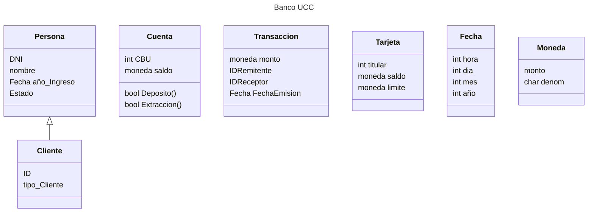

```mermaid
---
title: Banco UCC
---
classDiagram
    class Persona{
      DNI
      nombre
      Fecha año_Ingreso
      Estado
    }
    Cuenta
    Persona <|-- Cliente
    

    class Cuenta{
        int CBU
        moneda saldo
        bool Deposito()
        bool Extraccion()
    }

    class Transaccion{
        moneda monto
        IDRemitente
        IDReceptor
        Fecha FechaEmision
    }
    
    class Tarjeta{
        int titular
        moneda saldo
        moneda limite
    }

    
    class Cliente{
        ID
        tipo_Cliente

        
    }

    class Fecha{
        int hora
        int dia
        int mes
        int año
    }

    class Moneda{
        monto
        char denom
    }


```