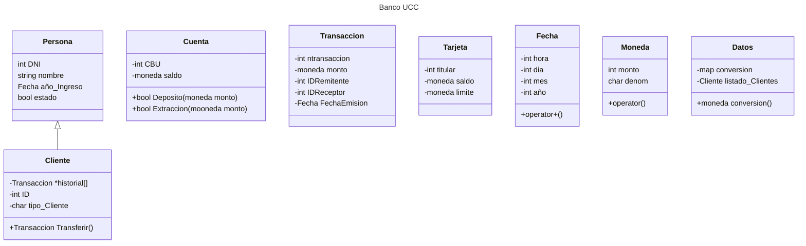

```mermaid
---
title: Banco UCC
---
classDiagram
    class Persona{
      int DNI
      string nombre
      Fecha año_Ingreso
      bool estado
    }
    Cuenta
    Persona <|-- Cliente
    

    class Cuenta{
        -int CBU
        -moneda saldo
        +bool Deposito(moneda monto)
        +bool Extraccion(mooneda monto)
    }

    class Transaccion{
        -int ntransaccion
        -moneda monto
        -int IDRemitente
        -int IDReceptor
        -Fecha FechaEmision
    }
    
    class Tarjeta{
        -int titular
        -moneda saldo
        -moneda limite
    }

    class Cliente{
        -Transaccion *historial[]
        -int ID
        -char tipo_Cliente
        +Transaccion Transferir()
    }

    class Fecha{
        -int hora
        -int dia
        -int mes
        -int año
        +operator+()
    }

    class Moneda{
        int monto
        char denom
        +operator()

    }

    class Datos{
        -map<char, int> conversion
        -Cliente listado_Clientes
        +moneda conversion()

    }
```